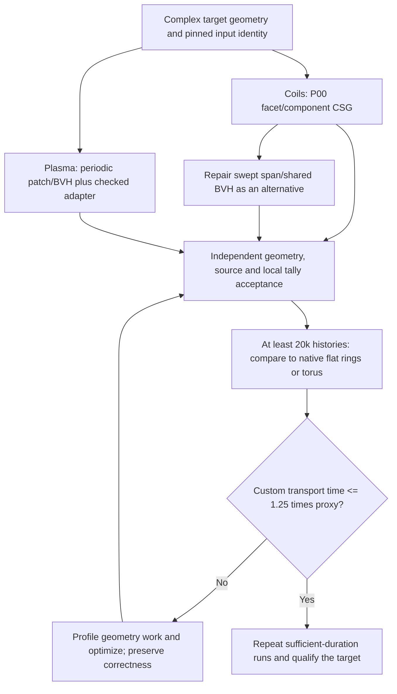

# Current coil and stellarator-plasma method map

The [project goal](PROJECT_GOAL.md) is accurate complex target geometry with transport elapsed time <=1.25 times a similarly sized built-in **flat ring for coils** or **torus for plasma**. Analytic torus/circular-coil timings do not qualify the complex target.

## Current choices: use these for the next development work

| Target | Selected development route | Best relevant speed evidence | What to do next |
|---|---|---|---|
| **Complex coil winding packs** | **P00 native facet/priority-component CSG** is the best currently executed pack candidate. Develop its fidelity, ownership and acceleration. Keep repaired local-span/shared-coil BVHs as the parallel general-swept design to recover. | Latest fixed-section 20k pair: P00 **5.774115 s transport**, **11.152920 s process wall**, versus native rings **1.203533 s transport**. Custom/proxy **4.797639**: fails <=1.25. This repeats the same P00 method; earlier 7.836203 s does not imply a kernel change. No qualified full-pack winner is established. | Profile facet/component distance/classification work and ownership crossings; test conservative BVH exclusion plus exact local facet tests. Close seam/continuous-target fidelity, first-root and per-coil/local-tally accuracy. Compare priority/component versus union on identical represented solids. |
| **Nonaxisymmetric stellarator plasma** | **Local periodic spline patch/BVH with the current checked OpenMC adapter.** This remains the selected general-plasma architecture. Optimize local candidate exclusion and query work while preserving boundary failure checks. | Fresh matched 20k replay: old-source rebuild **27.225501 s**, retained current **28.970192 s**. Current is 1.064083 times old in this pair. Older unchecked miss handling is diagnostic only, so keep the checked adapter for development. | Profile queries/candidates/iterations/crossings, then optimize and rerun against a same-size built-in torus with frozen physics/tallies. Close CAD/first-root/local-bin accuracy. |

**Fastest qualified full-target method: NOT YET ESTABLISHED for either row.** The selections above are development decisions based on target relevance and executed evidence, not production acceptance or proof that every variant has been compared.

Within the two retained P00 pack variants, priority/component recorded **0.37243 s** versus common-material union **0.72726 s** on the same 360-history material-entry validation bank. This is the fastest observed pack variant in that small diagnostic and supports choosing priority/component first. It is below the 20k acceptance minimum and does not establish a full-pack native-proxy winner.

## Method and branch locations

| Method | Source branch/checkpoint | Role |
|---|---|---|
| P00 native facet/component CSG | `JS/stellarcsg-local-continuation-20260925`, checkpoint `3b61ee47fa498e2b4171756e5352f57de80de2a4`; runtime lib `fbc38ded...` | Selected physical-pack candidate; periodic facet fixture is derived by seam repair, with vertex movement <=0.003328774 cm. This is not a continuous CAD error certificate. |
| Local swept spans + shared coil BVH | `codex/stellarcsg-native-csg-foundation-20260828`, checkpoint `5faf87421d5d2066278c7ae02e38138fc22ec894`; preserved composite source `3041a938...` | Fast historical general-tube architecture to repair; old wrong-first-root/tangent cases prevent using it unchanged. |
| Periodic plasma patch/BVH | Foundation/composite lineage; current checked adapter in `JS/stellarcsg-astra-kernel-20260926`, retained runtime lib `f301f7a7...` | Selected general-plasma development architecture. Current and preserved principal generic solver bodies match after whitespace removal; adapter/compiler/workload must be considered separately. |
| Rebuilt old plasma source | Composite checkpoint `3041a938c3fb0bc349654f37b0b3ebcd3cd5a9bb`, rebuilt offline with current GNU14/HDF | Fastest variant in the new two-runtime plasma diagnostic; **not eligible for production promotion** because old unchecked boundary handling remains. This is source reproduction, not the original archived binary. |
| Certified global offset + interval cache | Current Astra branch; separately bound cache DSO `b3f2aeea...` over retained lib `f301f7a7...` | Restricted round-offset reference/fallback and correctness research. **Not the selected fast full-pack route**: 20k repeat took 165.927178 s transport. |
| Exact native torus/circular-coil dispatch | `codex/stellarcsg-torus-class-fastpath-20260901` and `codex/stellarcsg-composite-blanket-interoperability-20260901` | Preserve for genuinely analytic inputs and controls. **Not a replacement for complex stellarator plasma or winding packs.** |

Source checkpoints identify lineage. Actual timing belongs to the recorded executable/library and input hashes, not automatically to every build on that branch. Full bindings are in the [branch review](reports/FASTEST_METHOD_BRANCH_REVIEW_20260926.md).

## How far are we from the native-proxy goal?

| Separate comparison | Custom transport s | Built-in proxy transport s | Status |
|---|---:|---:|---|
| General WISTELL plasma / similarly sized torus, matched /009 pilot | 34.819716 | 0.218000 | **FAIL**: custom/proxy 159.7233, versus allowed <=1.25 |
| Restricted round-tube coil / flat ring, matched /009 diagnostic | 167.489939 | 0.104744 | **FAIL**: 1599.0470; also not a physical winding pack |
| Derived P00 pack / native PCA ring envelopes, /010 pilot | 7.836203 | 8.652459 | **INCONCLUSIVE for goal**: envelopes are 64-260 cm wide and 13-408 cm high; all 18 source sites start in iron versus none in the facet entry fixture |
| Derived P00 pack / fixed 30x30 cm rings, 20k each | 5.774115 | 1.203533 | **FAIL in this pilot**: custom/proxy 4.797639, allowed custom <=1.504416 s. Four of 18 unchanged source sites start in fixed-ring iron versus none in custom; physical/accuracy gaps remain. Independent timing/binding review accepted. |

The fresh old/current plasma replay is a **runtime regression comparison**, not a new torus-proxy comparison. Do not divide its 27.23/28.97 seconds by the earlier torus timer and label that a new matched speed gate. Its completed 20k-per-variant timing/binding/finite-array accounting passed independent diagnostic review; independent physical geometry/first-root/scoring accuracy remains unresolved.

The historical 48-coil 0.33282 s/100k and plasma 0.36314 s/10k observations identify promising architectures, but are different workloads. The old coil set used near-vacuum material with no tallies. Old near-circle reruns at ~0.23 s predict sampled analytic torus dispatch. None of these establishes full-target native-proxy success.

For the next optimization, record actual collision/crossing counts and time in distance, classification, normals and remaining physics. Proxy shapes change trajectories and material paths; the observed elapsed gap is not automatically pure geometry-query overhead. These measurements diagnose the gap; the acceptance metric remains total elapsed transport seconds.

## Decision map

## Evidence and immediate continuation

- [Complete build/transport phase accounting](reports/BUILD_TRANSPORT_RESULTS_20260926.md).
- Coil /010: `reports/coil-profile-20260926/matched-replay-010/` retains five successful workers and the current legacy unresolved-query abort; `fixed-section-plan-010/` retains corrected section/source controls.
- Corrected coil /010: `reports/coil-profile-20260926/fixed-section-pair-010/{SUMMARY.json,TERMINAL.json}` records the independently reviewed completed pair and failed timing gate. This one ordered pilot does not quantify timing uncertainty, physical CAD accuracy or portable speed. Reused XML preparation was 0.144553/0.156727 s; full cold construction remains UNKNOWN and no software build ran.
- Plasma /010: `reports/plasma-best-time-20260926/source-rebuild-010-01/comparison.json` records old/current transport, initialization, output and wall separately. Build was 764.919447 s; it is software compilation, not geometry construction.
- [Plasma run/terminal collection handoff](reports/plasma-best-time-20260926/REBUILD_RUN_HANDOFF_010.md). Use existing run/session identity; do not start a duplicate rebuild.
- Plasma driver and both native workers exited zero. The outer wrapper exited 1 on lease-directory cleanup; the owner's subsequent bounded empty-directory release and absent-lock receipt are retained. This administrative failure is not hidden or converted to full-block success.
- Both terminal timing diagnostics are independently reviewed. Next: profile and improve the selected routes while closing physical geometry/scoring acceptance. Neither DAGMC/Embree same-target comparison nor complete cold geometry build is currently available as a qualified winner.
